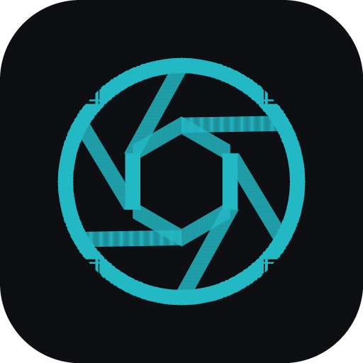

<div align="center">



# Fotolio

**A self-service photo-portfolio platform.** Upload photos, let them be optimised for the web
automatically, arrange them into galleries, design a hero, and publish your own portfolio site — on
a slug, a subdomain, or your own domain.

<p>
  <a href="LICENSE"></a>
  
  
  
  
</p>

</div>

---

## What's inside

| Part | Stack | Path |
|------|-------|------|
| **API + public site renderer** | PHP 8.2+ · clean MVC · PDO · JWT auth · Intervention Image | [`/api`](api) |
| **Dashboard / builder** | React · Vite · Tailwind (SPA) | [`/dashboard`](dashboard) |
| **Docs** | Styleguide · deployment | [`/docs`](docs) |

The **public portfolio sites are server-rendered by PHP** (for SEO, speed and custom-domain
routing); the **builder is a separate SPA** that talks to the PHP API.

### The headline feature — automatic optimisation
Every uploaded image (any of JPEG/PNG/WebP/GIF/BMP; HEIC/TIFF with the Imagick backend) is turned
into responsive `thumb / medium / large` variants as **WebP + JPEG fallback**, plus a tiny blurred
**LQIP** placeholder. EXIF (camera, lens, capture date, GPS) is read to prefill metadata. The UI
shows a **before/after loupe** with real bytes saved, reduction %, and estimated load-time gain at
5 Mbps — and a quality slider to re-optimise.

---

## Quickstart (local dev)

Requires PHP 8.2+ (with `gd`, `exif`, `zip`), Composer, and Node 18+. No database setup needed —
local dev uses **zero-config SQLite** (production uses MySQL/MariaDB; both share the same
prepared-statement code path and driver-aware migrations).

```bash
# 1) API
cd api
composer install
cp .env.example .env                       # dev defaults are ready to go
php -r 'echo "JWT_SECRET=".bin2hex(random_bytes(32));' >> .env   # or edit .env
php bin/console setup                       # migrate + seed demo data
composer serve                              # API + public sites → :8000 (with upload limits set)
# ^ equivalent to: php -d upload_max_filesize=64M -d post_max_size=80M \
#     -S 127.0.0.1:8000 -t public public/index.php

# 2) Dashboard (new terminal)
cd dashboard
npm install
npm run dev                                 # dashboard → :5173 (proxies /api + /media to :8000)
```

Open the dashboard at **http://localhost:5173** and sign in with the seeded demo account:

```
demo@fotolio.app  /  password
```

The demo site is published at **http://localhost:8000/@meggen-studio**.

> `php bin/console` also has `migrate`, `migrate:fresh`, `seed`, and `fresh` (fresh migrate + seed).

---

## How routing works

`api/public/index.php` is the single front controller. It resolves each request by `Host` + path:

- `/api/*` on a platform host → JSON API
- `/@<slug>` on a platform host → that user's published site
- a matched subdomain or a verified custom domain → that user's published site
- otherwise the platform root serves the dashboard SPA / landing

See [`docs/DEPLOYMENT.md`](docs/DEPLOYMENT.md) for the production topology, wildcard DNS, and TLS.

---

## Design

The whole product follows [`docs/STYLEGUIDE.md`](docs/STYLEGUIDE.md) — a "Darkroom & Lightbox"
system: neutral graphite chrome so photos carry the colour, a single lens-coating teal accent, and
mono "instrument readout" type for all measured data. Full light + dark themes.

## Notes
- **Auth:** email + password is fully functional (argon2id + JWT access token + httpOnly refresh
  cookie). Google / Facebook / Apple buttons are present and call live stub endpoints that return
  "not configured" until credentials are added.
- **Not in v1 (by design):** billing, team accounts, empty stub pages.

## License

Released under the [MIT License](LICENSE) © 2026 Olivier Lüthy. You're free to use, modify and distribute this
software, including commercially, as long as the copyright notice and license are included.

## Author

Built by **Olivier Lüthy** — [GitHub](https://github.com/olivierluethy).
